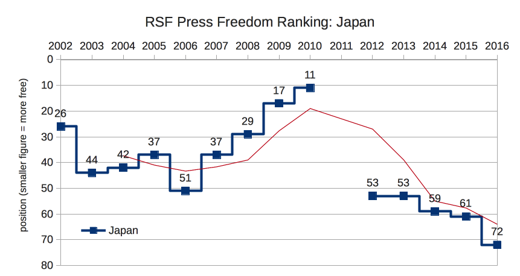

# Introduction #

Japan has fallen down the press freedom rankings over the past few years, in particular the drop in the ranking from 2010-11/12 - in the aftermath of the Fukushima Dai-ichi nuclear disaster - reported as being in part due to complaints from freelance journalists that

> public debate was being stifled [and was] subjected to censorship, police intimidation and judicial harassment.[^rsf]

[^rsf]: https://rsf.org/en/world-press-freedom-index-2013

it's still up there in the 'free' zone but at the lowest level since the series began in 2002, such a rapid fall, from 11 in 2010 to 72 just six years later - should be cause for concern. WHY??

: **Table 1:** Reporters without Borders (https://rsf.org/en/ranking) N.B. the ranking combined the 2011-2012 ratings in one figure, this has been graphed as 2012 below.

| 2009 | 2010 | 2011/12 | 2013 | 2014 | 2015 | 2016 |
|-----:|-----:|--------:|-----:|-----:|-----:|-----:|
|   17 |   11 |      22 |   53 |   59 |   61 |   72 |

: **Figure 1:** Reporters Sans Frontieres Press Freedom rankings for Japan since 2002, red line shows 3-period moving average.

<!---
| 2006 | 2009 | 2011    | 2015   | 2016   |
|------:|------:|---------:|--------:|--------:|
| 35| 33| 32| 25/100| 26/100|
-->

David Kaye's visit to Japan in October 2016 confirmed the existence of a sense of uneasiness within the Japanese press, particularly with regards to its ability to maintain an attitude of independence toward a government taking an increasingly proactive approach to 'press management'. During a press conference at the end of his visit, the UN Special Rapporteur reported journalists concerns in these terms;

> quote 1

He summarise his experience of talking to various actors within the Japanese mass media system as ...

> the problem is, the system of journalism and the structure of media itself in Japan doesn't seem to afford journalists the ability to push back against government encroachments, and you see this [...] in the example of the _kisha_ club system, we learned about serious concern about senior members of the independent media meeting with senior members of the government, we heard these stories repeatedly, and **I would really encourage journalists to organise themselves, to adopt a professional organisation, a union in effect, in which journalists can express media-wide solidarity**, can perhaps enjoy self-regulation through a press council, in short, the media itself has a role to play, the media itself bears some responsibility for this situation (emphasis added)

<!--  and I hope thes two different tasks [change law, organise] could protect the independence fo the press. -->

Added to this is the fact that the mainstream media in Japan is highly dominant in a very isolated market, Japanese readers, unlike readers of English, do not have the luxury of turning to say the US, Australian or even Russian press for alternative views; Japanese media firms are the pretty much the only producers of Japanese-language news and information. The seven _zenkokushi_ (papers with national daily reach) employ just under 20,000 staff, roughly half of these in editorial [(METI 2015 Report)](http://www.meti.go.jp/statistics/tyo/tokusabizi/result-2/h27.html). Between them they have daily sales of roughly 30 million copies, that is they supply daily news to over half of Japan's  roughly 52 million households [(Japan Statistical Yearbook 2017)](http://www.stat.go.jp/english/data/nenkan/66nenkan/index.htm). Add to this the influence of the main news agencies, Kyōdo and Jiji, who supply the bulk of news to local and regionals(CITATION! RAUSCH? [@Rausch:2012]), it can be seen that there is little scope for alternative and 'left-field' voices.[^fail]

[^fail]: the repeated failures of 'public journalism' and 'citizen reporter' based initiatives also illustrates this dominance, and also perhaps a lack of interest on the part of audiences for 'alternative' sources.

As far as broadcast news is concerned, the picture is similar; the most watched news program, NHK's 7pm news is regularly watched by 16-17 million people, news on commercial channels brings in combined audiences of over 30 million; the top-rated commercial news show, TV Asahi's _Hōdō Station_, gains in the region of 14 million viewers, NTV's early evening _news every_, about 12 million.[^scr]

[^scr]: This adopts the rough approximation, 1% = 1 million viewers, as suggested by @Torigoe:2002. Figures compiled from Autumn 2016 ratings data - [Video Research](https://www.videor.co.jp/data/ratedata/backnum/2016/index.htm)

## Aims

The question this paper addresses is: Why, given the obvious concern with independence and what Kaye describes as the deep commitment to freedom of speech and expression in Japan, have journalists not organised in the way he describes?

Also, what of the rumoured 'collectivistic' instincts of Japanese society? Why no collective action from journalists to respond to this common threat?

This paper argues that the root causes of this failure to organise, can be found in a) the nature of the professional education of journalists, and b) the nature of employment structures for journalists in Japan. The effects of these social institutions can be observed manifested as the 'professional ideology' of journalists in Japan, this paper uses certain aspects of this ideology as proposed by Deuze [-@Deuze:2005].

This has led to a situation where reporter identity is centred on entities - companies as employers - which are required (at least as far as rhetoric is concerned) to be in a relationship of 'fierce competition'.

Are Japanese journalists equipped to push back against the forces that pressure them? Can the 'professional identity' of the journalist be seen as a protective barrier, a layer of insulation, which allows journalists a psychological cushion and promotes the kind of activity and relationships expected of the ethical journalist. Does the lack of this cushion contribute to the state of journalism in Japan at the current time?

This paper will not deal with the influence if the *kisha kurabu* 'press club' system, probably the most widely documented aspect of journalism in Japan, as it has been dealt with extensively  elsewhere [see for example @Freeman:2000; @Iwase:1998], but it is worth summarising the effects of press club journalism; the collective responsibility implied by press club membership leaves the press open to pressure both from peers - to not rock the boat and upset relations with sources - and from sources who can deny access more or less at will. Given the possibilities offered by social media for politicians to simply bypass the main stream media, it is difficult to see how the traditional "balance of power" for control of access (press to politicians, politicians to the public) can be maintained. Japanese politics has been rather late to the social media jamboree with the use of online campaigning in general elections prohibited until 2013, but this will change.[@Osaka:2014, p51]

# Ideology of Journalism

Discussion of the elements of the nature of the journalistic identity has been an integral part of academic understandings of news and news-gatherers since the very early days of the field (eg?). Deuze[-@Deuze:2005] sums up the essential features of what he refers to as the journalistic ideology:

>   • Public service: journalists provide a public service (as watchdogs or ‘news-hounds’, active collectors and disseminators of information);\
>   • Objectivity: journalists are impartial, neutral, objective, fair and (thus) credible;\
>   • Autonomy: journalists must be autonomous, free and independent in their work;\
>   • Immediacy: journalists have a sense of immediacy, actuality and speed (inherent in the concept of ‘news’);\
>   • Ethics: journalists have a sense of ethics, validity and legitimacy.\

[@Deuze:2005, p447]

Where and when are these beliefs about journalism acquired?

*ANSWER THIS FOR THE GENERAL CASE*

What has been the effect of a strong bureaucratic tradition on the role of professional ideas in journalism in Japan?

*THIS IS WHAT I LOOK AT HERE*

# Journalism in Japan #

Japan has a history of journalism stretching back to its emergence from under the control of the Tokugawa Bakufu in the latter decades of the nineteenth century.

Early journalism was often politically sponsored and overtly partial, it was only with the adoption of the 'objective' mass circulation model that the press began to require something like the 'professional' journalist rather than the partisan supporter and advocate of a cause.

First professional journalists - ?

## Development of journalism as a trade

[@Schafer:2012 p10] 1875: formation of *Shimbun Kisha Rengō* in reaction to increasingly restrictive laws which affected the press and protection against libel.[^law]

[^law]:*shimbunshi jōrei*, *zanbōritsu*

1880s - new university graduates began to move into journalism, numbers increased through the 1920s, economic recession meant a dearth of graduate employment opportunities at a time when the popular press was expanding and looking to increase the quality if its content by employing better educated reporters.[@Schafer:2012 p36]

However along with this shift toward employing individuals who had passed through the system of imperial universities - and reducing the number of 'enthusiasts' - who saw themselves as 'educators of society' - came an increase in the number of 'company employees'. In 1917, Motoyama Hikoichi[^moto] had characterised this shift with the following words,

[^moto]: journo at *Osaka Shinpō*, then *Jiji Shinpō*, 1888 reorganised *Osaka Mainichi SB*, became pres in 1903: Advocate of foundation of newspaper studies depts at univs and later president of *Osaka Mainichi* newspaper.[@Schafer:2012 p36n]

> a journalist, just like a salaryman of any other profit-oriented company, needs to spare no efforts in favor of his company. [@Schafer:2012 citing Ono:1971]

The journalist was increasingly seen as primarily a company employee like any other. And the 'Shimbun-gaku' departments established at universities were aimed at providing potential journalists with the requisite knowledge to allow them to gain employment at newspapers on graduation. It took until 1929 for a Tokyo Imperial University to establish a 'Newspaper Research Seminar' as part of its literature department.[@Schafer:2012 p40]

Ono??? was the prime motivator in the establishment of this body, he saw the professional training he sought to offer as a way to push back against the 'degeneration' of the press he perceived in the 1920s, and to raise journalists who would again act as educators of society, ensuring that expert and specialist opinion would be made available to the newspaper's mass audience.[@Schafer:2012 p45--5]

[@Huffman:1997; @Lange:1998]

## Education of Journalists ##

Deuze, in his typology of global journalism education approaches, categorises the Japanese system as characterised by

> [p]rimarily on-the-job training by the media industry, for example through apprenticeship systems (Austria, Japan; Great Britain and Australia started this way, as this is a typical
feature of the Anglo-Saxon model).[@Deuze:2006 p22]

See parts of...

[@Cooper-Chen:1997a; @Fujita:2004; @Hanada:2003; @Hashimoto:2003a; @Ikuta:2004; @IwabuchiY:2004; @Tsukamoto:1993; @Tsukamoto:2006]

Indeed, outside employment there is little opportunity for potential journalists in Japan to acquire knowledge, skills and experience of their chosen trade.

As a route to employment an education in journalism can be all but irrelevant, as @Cooper-Chen:1997a [p22] suggest, company recruitment relies on testing general skills (general knowledge, literacy) so a degree from *any* department in a prestigious university may be worth more than specialist knowledge from a less prestigious institution. Theses attitudes and the expectations of media employers - virtually no value attached to any sort of university-based journalistic education [@Fujita:2004 p1] in Japan seems to go back to at least the 1930s [@Uchikawa:2003 p14].

@Fujita:2004 points to changes in the environment as a cause of the growing perception that the 'on-the-job training' (OJT) system was not producing the desired results, this led to a renewed debate about the role of university-based journalist education in Japan in the later 1990s and early 00s - the increasing use of technology at all levels of newspaper production and the increased pressure on workers which left little time for senior reporters to train new staffers.[@Fujita:2004 p3]

This debate took place in reaction to a number of incidents (plagiarism[^plag], invasions of privacy, 'overheated' herd reporting (*media sukuramu*), libel)[@Ikuta:2004 p1]. Ikuta also identifies the pressures of adapting to new technologies as a root cause in the drop in journalistic standards.

[^plag]: About one-third of an article in the 8 Jun 2000 edition on the *Asahi Shimbun* was found to have been plagiarised from the local *Chugoku Shimbun* by a reporter in the Hiroshima office.[@Shibata:2003 p137]

Ikuta describes the actual content of OJT at the +as; new employs spend four or five years at a local office where their development can be overseen trained by experienced reporters, traditionally the local office would be a mix of new, middle career and 'veteran' reporters. However Ikuta argues that this system broke down due to the HR policy of concentrating middle-career reporters in the head offices, which led to an over-reliance on early-career reporters in local bureaus. (ibid. p224/1180)

A significant effect of a primarily OJT-based system might be that it becomes more difficult to have any external standard (what kind of standard?); if the measure of professionalism is how closely one approximates the work of one's mentor then it is easy for _practical_ understandings of how one does journalism --- rather, how one does the job of journalist --- to become prioritised over how should (according to some exterior abstract measure - whether a code, an exemplar or whatever) journalists set about doing their work. It might also be readily supposed that such a system might turn out to be more 'malleable' from the political sources' point of view with the local (in time and space) understandings of the  necessities of practical reporting being passed on, and thereby taking on the status of 'common sense', within a single generation.

# Living the ideology?

This section surveys how the five aspects of the journalistic ideology outlined by Deuze(see above) are materialised in Japan; it concentrates on 'ethics' and 'autonomy' as areas which can be seen to have a particularly significant impact on journalistic practise.

I will deal with the less controversial aspects - public service, objectivity, and immediacy - before moving on.

See NSK Ethics Guide[^guide]

## Public service

Journalists relations with the 'public' - public journalism? Surveys of Japanese journalists understandings of the audience?

Central term for Japanese discussion of the role of journalists is 'the right to know' (*shiru kenri*); this would seem to indicate a pervasive consciousness of journalism as a service to the general public. Of course, this leaves open the question of how this idea is operationalised; in any particular instance, which public is to be served and how?

Willnat survey?

## Objectivity

The prime concern of reporters in Japan (see Weaver info) is the accurate reporting of fact. Is the corollary a reduction in the amount of comment and context provided?

When the broadcasting of television news started on NHK in the 1960s, the newspaper model was adopted as an organisational template and standard.

However, the political implications of 'objectivity' and 'balance' are continually debated and have been much criticised(CITATIONS) as a way to avoid the responsibility of making moral judgements and providing useful, informed evaluation of so-called 'facts', which, in many cases, may not be as 'self-explanatory' as they might at first seem.

If it is, as Tuchman [-@Tuchman:1972] suggests, primarily a 'ritual' through the enactment of which reporters and editors avoid potential censure, it is reasonable to expect - in a media system such as Japan's where there is the constant threat of pressure from powerful sources, that achieving 'objectivity' - and therefore insulating oneself from pressure as much as possible - would become a prime concern.

There are also commercial benefits; these were recognised early on by the press is Japan.[@Huffman:1997, p?]

## Immediacy

No doubt about this. Companies like immediacy as a measure of journalistic performance; results are generally quantifiable and unambiguous - it's usually fairly obvious 'who was first'.

Japanese newspapers still issue *gōgai* sheets, single sheet 'extras' handed out free, often at major railway stations (and thus coincidentally also useful for television news cameras), covering major and breaking stories such as the death of Fidel Castro or the resignation of President Park of South Korea.

The importance of immediacy for the printed press - the discourse of newspapering in Japan is still largely ambivalent about the existence and importance of the web - might also be detected in the ongoing commitment of all newspapers to deliver to subscribers homes[^deliv] very early in the morning thus ensuring the presence fo a daily paper and access to the news it provides 'at the breakfast table'.

## Autonomy

What is it that allows the journalist this autonomy? Identity as a professional that extends beyond the fact that they work for a company which 'does news'. Basis for maintaining the 'chinese wall' between business and editorial, insulation from source pressure etc.

The Japanese journalist, as a result of the diversity of educational backgrounds - surely a strength in terms of diversity of knowledge - lack any external power base (see article in Tumber!);

To be autonomous invites suspicion - to be outside a publicly legitimised organisation - the reputation of trades unions, other than the 'company unions' prevalent across much of Japanese industry is as 'trouble makers obsessed with Marxist doctrine'(CHECK!) - is to lose a credibility and social trust. Thus, without some sort of legitimate (by whose standards?) body to which they can refer, journalists are effectively restricted to acting within the bounds of the vertical company-based structure. The 'media-wide' cooperation that David Kaye referred to necessary to effect a concerted push back against top-down pressure is near impossible.

> ジャーナリストというより朝日新聞社員としての仕事をしている図式です

quote from - 新聞協会賞を2度受賞した*依光隆明*朝日新聞社編集委員
[@JCEJ:2014]

Then there is the question of industry autonomy from government power. The structures of the mass media (and in the broader economy in which media companies exist), gradually put in place over the 70 years since the end of WW2, has turned out to be a double-edged sword. The sections below focus on the linkages between legislation/regulation and media industries which can be seen as political pressure points, which are none the less so for not being employed as such.

### The Broadcast Act{-}

Identified by Kaye as an obvious political pressure point. Takaichi Sanae statements during 2015/6. Kaye suggests some 3rd party regulator equivalent to the US Federal Communications Commission(FCC). Such a body did exist briefly for a few days during the period between the passing of the Broadcast Act and the end of the US occupation, when it was the bodies first and most significant act was to dissolve itself, returning control of broadcasting to a ministry. So while there is a precedent for such a body, it is not altogether a promising one.

### Newspaper Resale System & Antimonopoly Rules {-}

* Weakness of JFTC
* Pricing cartel
* _Saihan seido_

The _tokushū shitei_ status of newspapers is a purely regulatory matter, the JFTC could decide to rescind it at any point. Occasional government reassessments of its social value serve to remind the newspaper industry of this.

## Ethics

Limited to the company motto!

Discussing the reaction of the New Delhi correspondents of the major Japanese media during the media restrictions which were part of the Emergency (1975?), and the reaction of the mass media in Japan when government took the decision to intervene in the 1994 *Tsubaki Hatsugen*[^tsuba] incident [@Berger:1995].

[^tsuba]: Explain this

> 日本人ジャーナリストが全員、ジャーナリストとしての使命に生きるよりも、私企業の倫理に従った [@Yamashita:1996, p37]

> 新聞記者[...]のたいがいの自己認識は、「企業内記者」である。[...] 競争は企業間競争であり、企業の枠や国境を超えたジャーナリストの意識は、弱い。[Kamata in Hanada p 50]

> ここが日本とそれ以外の国のジャーナリストとの大きな違いだ。例えば米国のメディアで働く者は、報道基幹の社員である前に、ひとりのジャーナリストであるという考え方が強い。
[@Uesugi:2008, p115]

# Discussion

Inability of J press to act for common good: Yamashita India Emergency anecdote [@Yamashita:1996, p35--6], also perhaps the profusion of microphones that one sees in front of speakers at a press conference in Japan[^mike] attest the unwillingness (lack of desire) of Japanese media companies to cooperate, even where the benefits are obvious, and the gains from non-cooperation negligible to nil.

[^mike]: It is common practise in many countries for the host of the press conference to provide feeds of the main microphone audio to all camera crews via a 'break-out box' positioned near to the designated camera position. Among other advantages to this system is that it helps reduce visual clutter in front of the speaker.

Does the newspaper press prefer a long decline into oblivion to any effort to reform?  Backward-looking, attempt to revert to golden era, rather than dealing with a changed world and being pro-active in defining a new and relevant role.

## Non-company journalistic groups

### JNPEA - Nihon Shimbun Kyōkai {-}

Primarily an industry group. Focussed largely on promoting the business interests of newspaper publishers; encouraging readership, surveying the effectiveness of advertising, monitoring copyright, and lobbying for continuation of legal privileges. It also issues the _Shimbun Rinri Koryo_ 新聞倫理綱領;

### Japan Congress of Journalists(JCJ){-}

(Nihon Janarisuto Kaigi)

Formed in 1955, currently claims a membership of 800.

Unlikely to be able to perform a uniting role as the focus of it's activity seems to be political rather than journalistic. This is --- however just the causes they choose might seem to be --- likely to alienate journalists who see themselves as being first and foremost 'objective' observers of, and reporters on society.

# References

[^guide]: 新聞倫理綱領\
2000（平成12）年6月21日制定\
　21世紀を迎え、日本新聞協会の加盟社はあらためて新聞の使命を認識し、豊かで平和な未来のために力を尽くすことを誓い、新しい倫理綱領を定める。\
　国民の「知る権利」は民主主義社会をささえる普遍の原理である。この権利は、言論・表現の自由のもと、高い倫理意識を備え、あらゆる権力から独立したメディアが存在して初めて保障される。新聞はそれにもっともふさわしい担い手であり続けたい。\
　おびただしい量の情報が飛びかう社会では、なにが真実か、どれを選ぶべきか、的確で迅速な判断が強く求められている。新聞の責務は、正確で公正な記事と責任ある論評によってこうした要望にこたえ、公共的、文化的使命を果たすことである。\
　編集、制作、広告、販売などすべての新聞人は、その責務をまっとうするため、また読者との信頼関係をゆるぎないものにするため、言論・表現の自由を守り抜くと同時に、自らを厳しく律し、品格を重んじなければならない。

[^deliv]: over 95 per cent of newspapers sold in Japan are delivered to the homes of subscribers, the remainder are sold through outlets like railways station kiosks and convenience stores.
